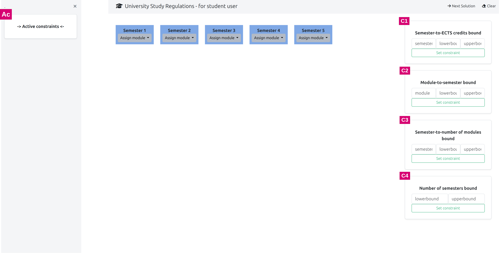
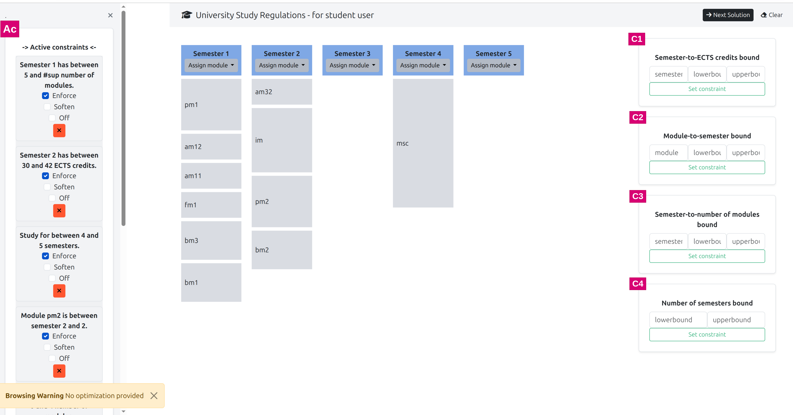

## Repo for the PATAT 2026 manuscript titled - _Reasoning about University Study Regulations Module-based Student Constraints and Preferences in Answer Set Programming_

#### Getting Started

To try out locally, you need to have [`pipenv`](https://pipenv.pypa.io/en/latest/) installed, then go through the following steps.

Install the required packages:

1. ```
    pipenv install
    ```

Activate the virtual environment:

2. ```
    pipenv shell
    ```

Execute the [`clinguin`](https://clinguin.readthedocs.io/en/latest/) user interface from the [`encodings`](/encodings) directory):

3. ```
    clinguin client-server \
   --domain-files encoding.lp cogsys.lp \
   --ui-files user_interface/ui_base.lp \
   --custom-classes user_interface/backend.py \
   --backend MyBackend -c n=5
   ```

> In case you have a different Python version on your machine, you may install `pyenv` to manage multiple Python versions - [this article](https://medium.com/@aashari/easy-to-follow-guide-of-how-to-install-pyenv-on-ubuntu-a3730af8d7f0) might help you.

___

## Screenshots

<br>
Figure 1: User interface when first-run

<br>
Figure 2: A study plan satisfying the given student constraints
